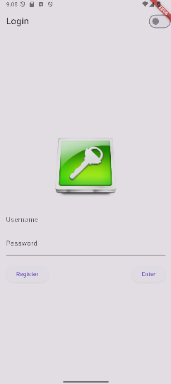
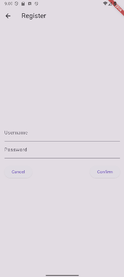
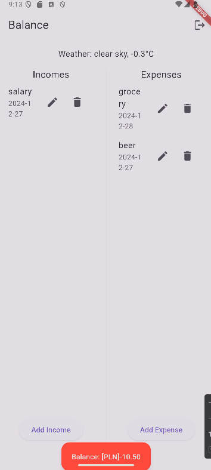
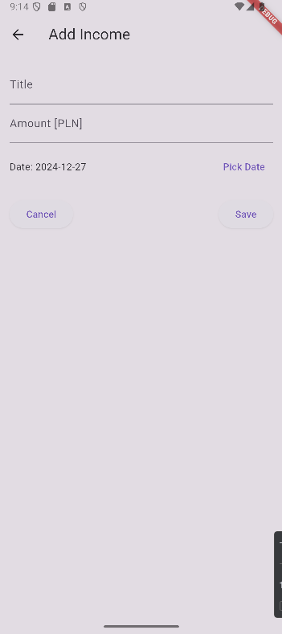

# labolatorium2

# Instrukcja urochomienia:

Aby aplikacja działała wymagana jest modifikacja plików
    -   pubspec.yaml:
w sekcji 
dependencies:
    flutter:
        sdk: flutter
    sqflite: any
    http: any
    path: any
    provider: any
    intl: any
w sekcji
    assets:
        - lib/assets/login_icon.png

Następnie należy wykonać polecenie flutter pub get

Dodatkowo należy zmodyfikować pliki
    -   Android/settings.gradle
        zmieniając wersje jak poniżej:
        id "com.android.application" version "8.3.2" apply false
    -   Android/gradle/gradle-wrapper.properties
        zmieniając wersję na najnowszą jak poniżej
        distributionUrl=https\://services.gradle.org/distributions/gradle-8.12-all.zip

# Opis funkcjonalności
    Cel aplikacji:
    Aplikacja umożliwia użytkownikom zarządzanie miesięcznym budżetem, w tym dodawanie przychodów i wydatków, obliczanie aktualnego bilansu oraz przeglądanie listy zapisanych operacji. Wszystkie dane są zapisywane lokalnie w bazie danych SQLite. Dodatkowo, aplikacja wyświetla aktualne dane pogodowe dla miasta Cieszyn i umożliwia przełączanie między trybem jasnym a ciemnym.
    
    Główne funkcje aplikacji:
        Ekran logowania:
            Użytkownik podaje nazwę użytkownika i hasło.
            Sprawdzana jest poprawność danych w tabeli users w bazie danych.
            Jeśli poprawne użytkownik przechodzi do ekranu bilansu.
            Jeśli dane są niepoprawne wyświetlany jest komunikat o błędzie.
            Dostępna jest opcja przełączenia trybu jasnego/ciemnego.
            Przyciski:
                "Enter" – Logowanie.
                "Register" – Przenosi na ekran rejestracji.
        Ekran rejestracja nowego użytkownika:
            Użytkownik podaje nową nazwę użytkownika i hasło.
            Dane są zapisywane w tabeli users.
            Po rejestracji użytkownik wraca do ekranu logowania.
        Ekran bilansu:
            Wyświetla Aktualny bilans: różnica między przychodami a wydatkami w bieżącym miesiącu.
            Aktualną pogodę w Cieszynie u góry ekranu.
            Przychody i wydatki są wyświetlane w formie listy:
                Dla każdej pozycji pokazane są: tytuł, data i kwota.
                Obok każdej pozycji są przyciski do edycji oraz usuwania.
            Edycja i usuwanie przychodów/wydatków    
                Użytkownik może edytować zapisane operacje (tytuł, kwota, data).
                Użytkownik może usuwać zapisane operacje.
                Po edycji/usunięciu lista na ekranie bilansu aktualizuje się automatycznie.
            Przyciski:
                "Add Income" – Przenosi do ekranu dodawania przychodu.
                "Add Expense" – Przenosi do ekranu dodawania wydatku.
                "Log Off" – Wylogowuje użytkownika i wraca do ekranu logowania.
            Wyświetlanie aktualnej pogody
                Pogoda dla Cieszyna jest pobierana z API OpenWeather.
                Wyświetlana jest aktualna temperatura i opis pogody (np. "clear sky, 12.3°C").
        Ekrany Dodawanie przychodu lub wydatku:
            Ekran wydatki jest identyczny z ekranem przychody pod wsględem funkcjonalności jak i wyglądu.
            Użytkownik wprowadza tytuł, kwotę i datę operacji (wybierając ją z kalendarza).
            Po zapisaniu dane są przechowywane w tabeli incomes lub expenses.
            Po zapisaniu użytkownik wraca na ekran bilansu.
    Obsługa błędów:
        Jeśli dane logowania są niepoprawne, użytkownik otrzymuje odpowiedni komunikat.
        Jeśli dane wejściowe (np. brak tytułu lub kwoty) są nieprawidłowe, wyświetlany jest komunikat z prośbą o poprawienie.
    Integracja z OpenWeather:
        Pogoda jest pobierana przy użyciu klucza API.
        Wyświetlane są dane w jednostkach metrycznych (°C).
# Struktura bazy danych
    Tabela users:
        id (INTEGER, klucz główny)
        username (TEXT, unikalny)
        password (TEXT)
    Tabela incomes:
        id (INTEGER, klucz główny)
        userId (INTEGER, klucz obcy z users)
        title (TEXT)
        amount (REAL)
        date (TEXT)
    Tabela expenses:
        id (INTEGER, klucz główny)
        userId (INTEGER, klucz obcy z users)
        title (TEXT)
        amount (REAL)
        date (TEXT)
# Zastosowane technologie:
    Flutter: Główna platforma do budowy aplikacji.
    SQLite (sqflite): Baza danych lokalna do przechowywania danych użytkownika, przychodów i wydatków.
    Provider: Zarządzanie stanem aplikacji (np. motyw jasny/ciemny).
    HTTP: Integracja z API OpenWeather.
    initl: Umożliwia formatowanie i parsowanie dat w różnych formatach w tym przypadku 'yyyy-MM-dd'.

# Zrzuty ekranu
    Login:

    Register:

    Error Handling:

    Balance:

    Add Income / Expenses

